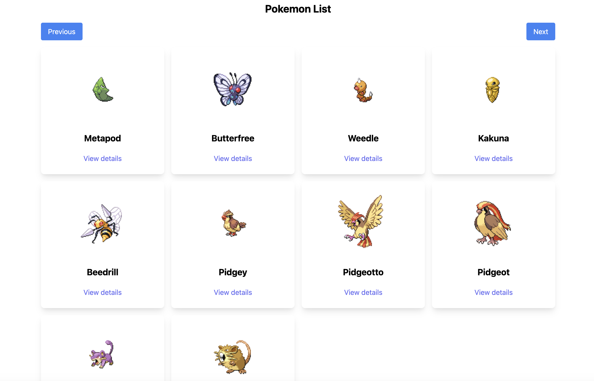

# Pokémon React App

This is a React application built with TypeScript that leverages the Pokémon API to display a list of Pokémon and their detailed information.
The application consists of two primary pages:
a list of Pokémon
and a detail page for each individual Pokémon. The detail page also showcases the selected Pokémon's evolutions, if any.
The app features modern web development tools and best practices, including Webpack, Babel, ESLint, Prettier, and Jest for testing.

## Screenshots

### Pokémon List Page



### Pokémon Detail Page

<div style="text-align: center;">
  
</div>

## Features

- 📋 Display a list of 10 Pokémon with their images and names.
- 🔄 Navigate through the list using next and previous buttons to load more Pokémon.
- 📄 View detailed information about each Pokémon, including their name, image, abilities, and evolutions.
- 🧬 Display a list of evolutions with images and names, which are also clickable to view their details.
- 🔙 Navigate between list and detail pages using the browser's back and forward buttons.
- 🔗 Bookmark or share links to favorite Pokémon's detail pages.
- ♿ Ensure accessibility and responsiveness for a wide range of devices and users.

## Technologies Used

- ⚛️ **React**: A JavaScript library for building user interfaces.
- 📜 **TypeScript**: A superset of JavaScript that adds static types.
- 🌐 **Webpack**: A module bundler for JavaScript applications.
- 🛠️ **Babel**: A JavaScript compiler for converting ECMAScript 2015+ code into a backwards-compatible version.
- 📏 **ESLint**: A tool for identifying and fixing linting problems in JavaScript.
- 🖋️ **Prettier**: An opinionated code formatter for consistent code style.
- 🧪 **Jest**: A JavaScript testing framework for unit and integration tests.
- 🔄 **React Router**: A library for routing in React applications.
- 🔍 **Jest Testing Library**: Utilities for testing React components.
- 🌳 **Redux**: A predictable state container for JavaScript apps.

## 🚀 Initial Setup

```bash
git clone https://github.com/Jagoda11/pokemon-react-app.git
```

cd pokemon-react-app

```bash
npm install
```

## 📜 Scripts

To run these scripts, use `npm run <script-name>`:

- `start`: 🚀 Builds the code and starts the application at `http://localhost:3000.`
- `build`: 🔨 Compiles the TypeScript code
- `test`: 🧪 Runs tests using Jest and generates a coverage report.
- `format`: 🖋️ Formats the code using Prettier.
- `lint`: 🧹 Lints all files in the project using ESLint.

- `pretest`: 🔍 Lints the code before running tests.
- `watch`: 👀 Runs tests in watch mode using Jest.
- `clean`: 🧽 Removes the `node_modules` directory and `package-lock.json` file.

## 🤖 GitHub Actions Workflows

This template includes several GitHub Actions workflows that automate various tasks:

- `ci.yml`: Runs your project's continuous integration (CI) tasks.
- `close-merged-pull-requests.yml`: Automatically closes pull requests that have been merged.
- `close-stale-issues-and-prs.yml`: Closes stale issues and pull requests.
- `label-new-pull-requests.yml`: Automatically adds labels to new pull requests.
- `thank-contributors-on-issue-close.yml`: Thanks contributors when an issue they commented on is closed.
- `welcome-new-pull-requests.yml`: Posts a welcome message on new pull requests.
- `welcome.yml`: Posts a welcome message on new issues.

These workflows use the `secrets.GITHUB_TOKEN` secret, which GitHub automatically creates for every repository. You can create a personal access token and add it as a secret in your repository. For more information, see [Creating and storing encrypted secrets](https://docs.github.com/en/actions/reference/encrypted-secrets).

## 🌐 GitHub Codespaces Support

This project includes a `.devcontainer.json` file which allows you to work on this project in a Docker container using [GitHub Codespaces](https://github.com/features/codespaces). This helps to maintain a consistent development environment, making it easier for you to collaborate with others without having to worry about individual setup.

GitHub Codespaces configures your development environment based on your project's needs using this file. When you create a new codespace for this project, the Codespaces environment is automatically configured as per the settings defined in `.devcontainer.json`.

To use GitHub Codespaces:

1. Navigate to the main page of the repository.
2. Click the Code button and then click "Open with Codespaces".
3. Click "+ New codespace".

Your development environment is now set up and running in a Docker container in the cloud. All commands you run in the Codespaces terminal will be executed inside the container. Any changes you make to the project will be reflected in the container and vice versa.

## Contributing

We welcome contributions! Here are some guidelines to help you get started:

1. **Fork the Repository**: Click the "Fork" button at the top right of this page.
2. **Clone Your Fork**: Clone your fork to your local machine.

```bash
git clone https://github.com/your-username/pokemon-react-app.git
cd pokemon-react-app
```

Create a Branch: Create a new branch for your feature or bugfix.

```bash
git checkout -b my-feature-branch
```

Make Your Changes: Make your changes to the codebase.

Commit Your Changes: Commit your changes with a clear message.

```bash
git commit -m "Add new feature"
```

Push to Your Fork: Push your changes to your fork.

```bash
git push origin my-feature-branch
```

Open a Pull Request: Open a pull request against the main branch of this repository.

## Issue Templates

When opening a new issue, please use the relevant template:

- [Bug Report](.github/ISSUE_TEMPLATE/bug_report.md)
- [Custom Issue](.github/ISSUE_TEMPLATE/custom_issue.md)
- [Feature Request](.github/ISSUE_TEMPLATE/feature_request.md)

## Code of Conduct

Please read our [Code of Conduct](CODE_OF_CONDUCT.md) to understand the standards we uphold in our community.

## 📝 License

This project is licensed under the MIT License - see the [LICENSE](LICENSE.md) file for details.

© 2024 Jagoda11

This README template provides a basic structure for documenting your projects. You can enhance and modify it for each new project based on the project's unique aspects and requirements.
